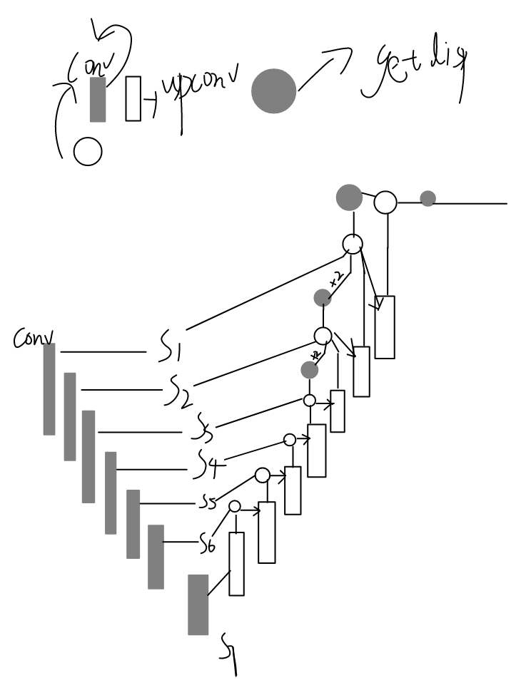
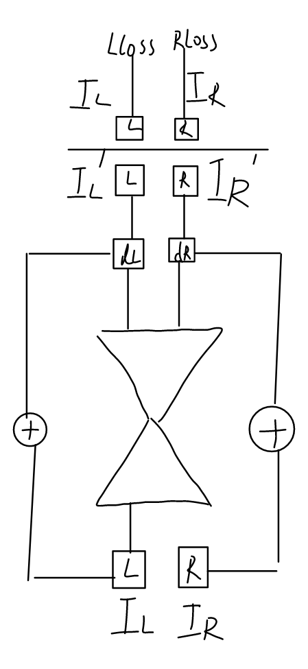
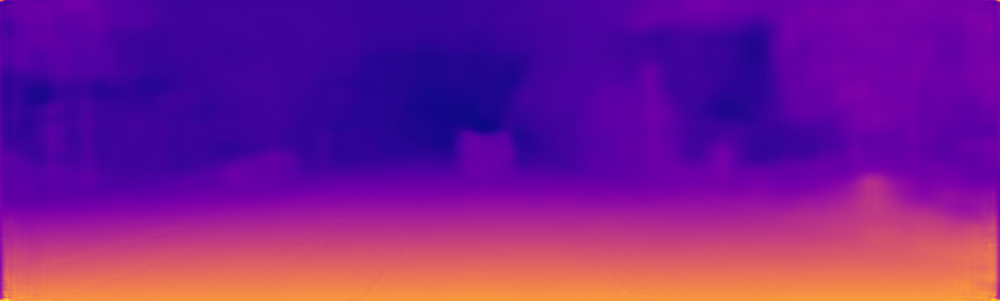
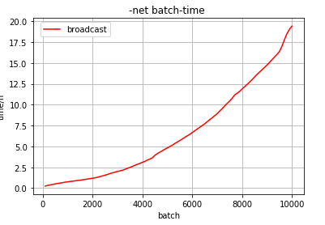
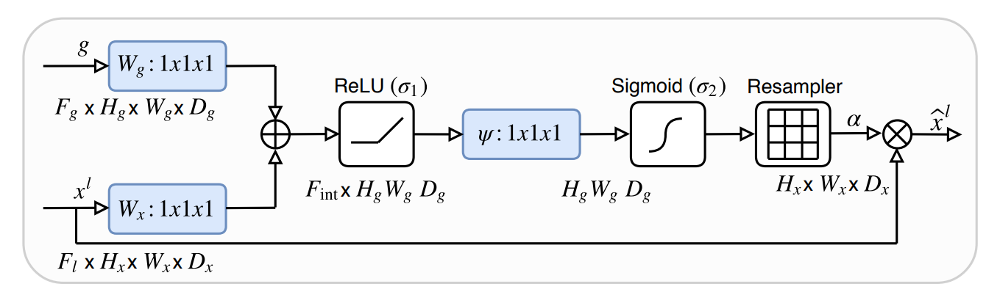
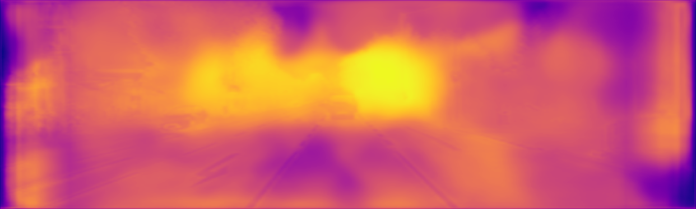
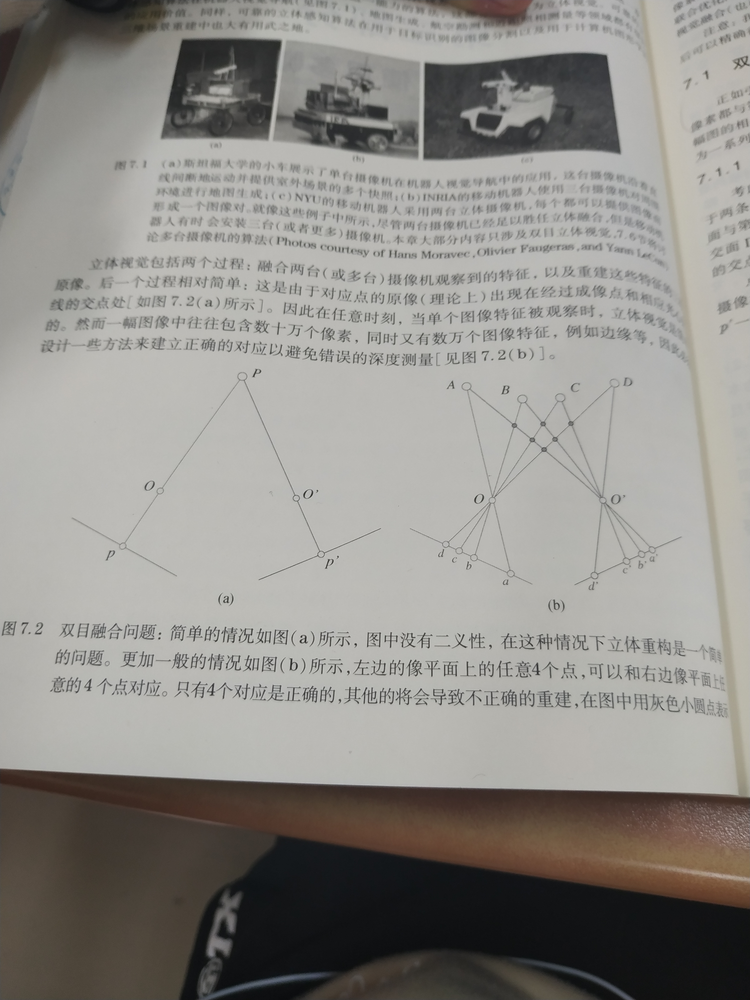
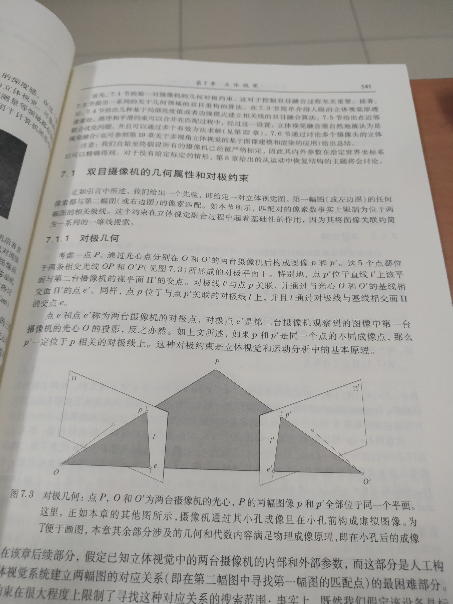
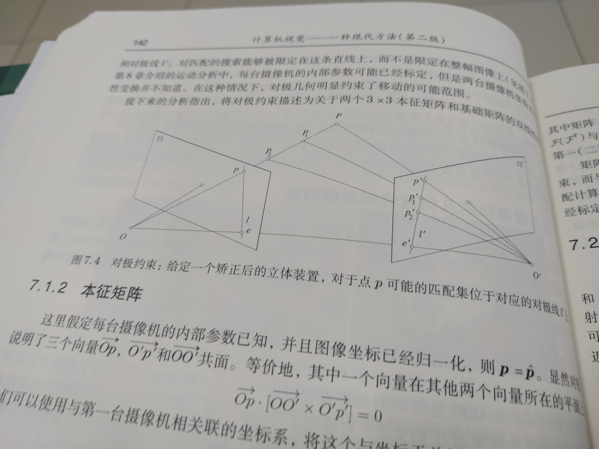
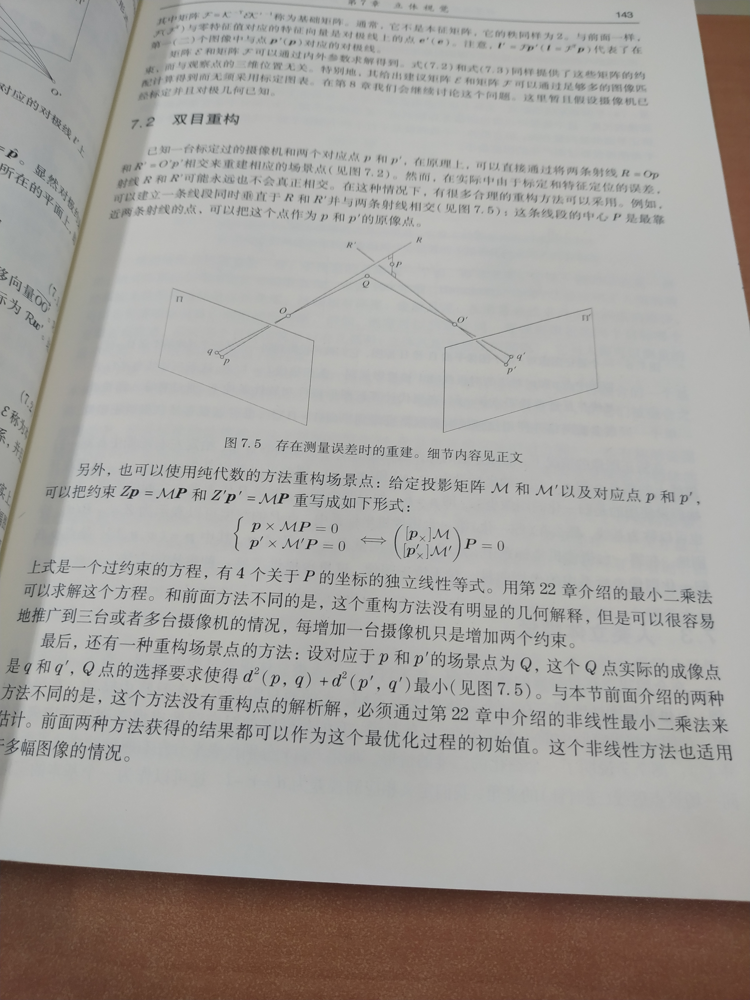

# Unet-Attention-depth-estimation

# Monodepth

[github仓库](https://github.com/mrharicot/monodepth)

[论文](https://arxiv.org/abs/1609.03677)

1400 batch表现：

10000 batch表现：

# -net
10000 batch表现：

# Attention 

## attention gate

### unet no attention one time

### unet use attention one time  

100 time loss 都出现消失

### unet no attention 100 time

### unet use attention 100 time

原图：

# 拓展阅读

### 双目融合问题

### 对极几何

### 双目重构

--- 

## 关于我

Github:https://github.com/Qinxianshen

CSDN: https://blog.csdn.net/Qin_xian_shen

个人博客: http://saijiadexiaoqin.cn/

Gitchat:https://gitbook.cn/gitchat/author/59ef0b02a276fd1a69094634

哔哩哔哩：https://space.bilibili.com/126021651/#/

微信公众号：松爱家的小秦

更多LIVE：

[如何利用 Selenium 爬取评论数据？](https://gitbook.cn/gitchat/activity/59ef0fbf54011222e227c720)

[Neo4j 图数据库在社交网络等领域的应用](https://gitbook.cn/gitchat/activity/5a310961259a166307ceadb4)

[如何快速编写小程序商城和安卓 APP 商城](https://gitbook.cn/gitchat/activity/5b628776ff984e633d987f7d)
